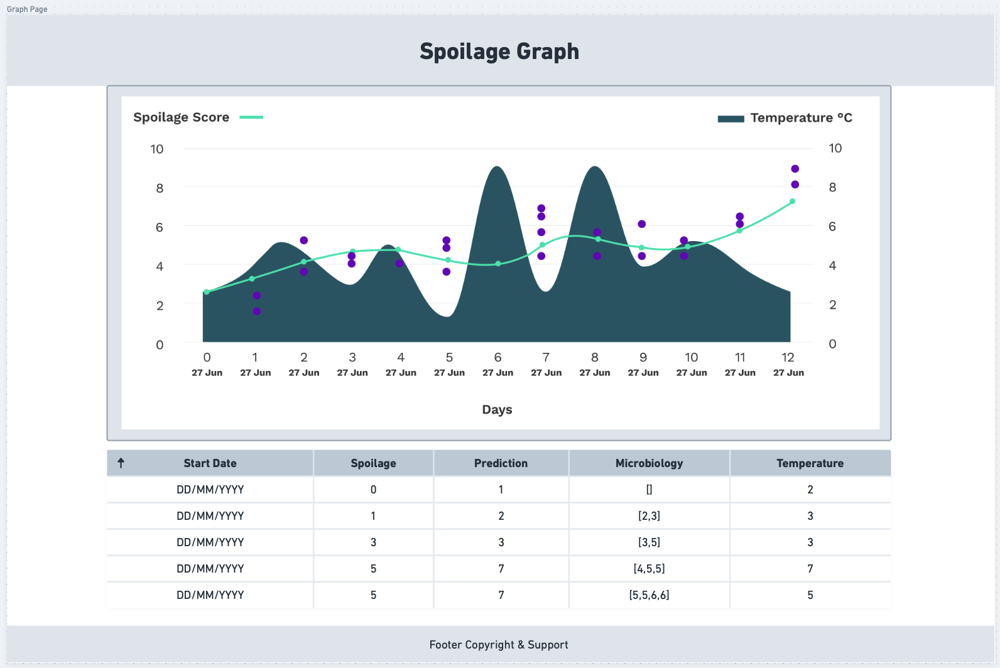

# Graph Page

This is a [Next.js](https://nextjs.org/) web-app created using [`create-next-app`](https://github.com/vercel/next.js/tree/canary/packages/create-next-app) using NextJS, TypeScript, and Tailwind CSS.

Clone this repository and edit the code in `src/app/page.tsx` to complete the assignment below.

## Getting Started

1. Download [node](https://nodejs.org/en/download)
2. Install the Node Package Manager [npm](https://docs.npmjs.com/downloading-and-installing-node-js-and-npm)
3. Install [yarn via npm](https://classic.yarnpkg.com/lang/en/docs/install/#mac-stable)

To run the development server, execute the command:

```bash
yarn dev
# or
npm run dev
```

## The Assignment

Develop a one-page web application to display spoilage data gathered from food packages that have our sensors integrated in an interactive graph.

**Your task**: Using the data below, make a one-page React web app using TypeScript and NextJS to display an interactive graph and table.

``` javascript
data = {
    "dateString":"01 Jan 2023",
    "name":"Chicken Breast 200g Test",
    "product":"Chicken Breast 200g",
    "sensors":["sensor_1", "sensor_2", "sensor_3", "sensor_4", "sensor_5"],
    "rows":[
        {
            "testStart":2023-01-01T12:59:30.000Z,
            "testDayNumeric":01,
            "spoilage":0,
            "prediction":0.20,
            "microbiology":[0,0.1,0.01],
            "temperature":4.01
        },
        {
            "testStart":2023-01-02T12:59:30.000Z,
            "testDayNumeric":02,
            "spoilage":0,
            "prediction":0.9,
            "microbiology":[0.8,0.3,1.11],
            "temperature":4.01
        },
        {
            "testStart":2023-01-03T12:59:30.000Z,
            "testDayNumeric":03,
            "spoilage":2,
            "prediction":2.12,
            "microbiology":[2.45,2,1.90,2.2],
            "temperature":4.01
        },
        {
            "testStart":2023-01-04T12:59:30.000Z,
            "testDayNumeric":04,
            "spoilage":6,
            "prediction":7.03,
            "microbiology":[7,7.65,6.90],
            "temperature":6.3
        },
        {
            "testStart":2023-01-05T12:59:30.000Z,
            "testDayNumeric":05,
            "spoilage":7,
            "prediction":8,
            "microbiology":[9.0,9.1,8.89,9.10,9.02],
            "temperature":5.11
        }
    ]
}
```

---

### Graph

The **graph** can be created using Apex, ChartJS, Recharts or any other suitable graphing library. For styling we recommend [Tailwind CSS](https://tailwindcss.com/docs/installation).

> * There should be two Y-axis, each displaying a range of values from 0-10.
> * The X-axis should display the value for testDayNumeric.
> * Temperature values should be displayed as an area graph.
> * Spoilage & Prediction values should be displayed as lines.
> * Microbiology values should be displayed as scatter dots on the same graph where there can be many microbiology values on the same day.
> * If there is no value for microbiology, spoilage, or prediction, nothing should be displayed for that time-series on the graph (don't plot a zero).

To extend the design, add a tooltip when the user mouses over or clicks a point on the graph so they can see the values colour-coded and displayed clearly, or change the information displayed dynamically in a div below the graph.

---

### Table

The **table** should be displayed below the graph, displaying the data using the following columns:

`[testStart, spoilage, prediction, microbiology, temperature]`.

> * The table can be created using any suitable library.
> * The table should include functionality to sort by testStart ascending or descending.

---


### Low Fidelity Designs



---

## Submitting your code

Deployment is not necessary as part of this exercise, but please verify that your code will run on different browsers (Chrome, Safari, Firefox) as well as on Mac and Windows machines so that we can review your work. It is encouraged to include screenshots of your work if you so wish.

To submit your work, please share a link to the github repo where all of your code is available via email and add Deirdre as a collaborator to your repository (username: DeeOConnor).

Please document your work in the form of comments or by adding to this README directly. We will be looking for accuracy and completeness of your solution, as well as clean front-end styling. You may use plugins and libraries to assist with functionality of graph.

We will verify the front-end visuals by cloning your work, then running `npm run build && npm run dev` to view the result of your assignment on [http://localhost:3000](http://localhost:3000). If you have made any changes to how the code is built and verified, please add these instructions when you submit your assignment.

## Resources

To read more about Next.js, Tailwind CSS, and React, take a look at the following resources:

* [Next.js Documentation](https://nextjs.org/docs) - learn about Next.js features and API.
* [Learn Next.js](https://nextjs.org/learn) - an interactive Next.js tutorial.
* [Tailwind CSS docs](https://tailwindcss.com/docs/installation).
* [Start a new React project](https://react.dev/learn/start-a-new-react-project).
